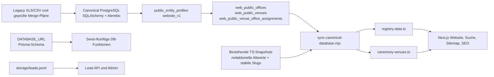

# Data Architecture v2

Status: technische Spezifikation, **keine Migration**. Stand: 2026-08-16.

## Leitplanken

- PostgreSQL bleibt der bevorzugte Canonical Core für CH/AT/DE.
- Bestehende UUIDs und `canonicalId` werden nie neu erzeugt oder geändert.
- Bestehende Website- und SEO-Slugs bleiben unverändert und erhalten später Aliase, falls ein neuer Routing-Standard hinzukommt.
- Der heutige Website-Lesepfad über `lib/registry-data.ts` und `lib/ceremony-venues.ts` bleibt bis zu einer ausdrücklich freigegebenen späteren Phase bestehen.
- `DATABASE_URL` und `PUBLIC_REPLICA_DATABASE_URL` haben getrennte Rollen; Prisma wird nicht zum Canonical Master.
- Tatsächliche lokale Runtime-DB konnte nicht geprüft werden, weil Docker Desktop nicht lief. Der erwartete Schema-Stand aus dem Repository ist Alembic `0005`. Der Relationstyp und vollständige Schema-Stand der produktiven Neon-DB sind **UNKNOWN / DB inspection required**; das Repository belegt nur den von der Website verwendeten öffentlichen Vertrag.

## A. IST



### Bestehende Quellen und Rollen

| Quelle | Heutige Rolle | Befund |
|---|---|---|
| Canonical SQLAlchemy/Alembic-DB | Identitäten, Geografie, Office/Venue, Provenance, Review und öffentlicher Vertrag | Bevorzugter Core; UUIDs, Soft Delete und Audit-Felder sind vorhanden. |
| Über `PUBLIC_REPLICA_DATABASE_URL` erreichbare DB | Build-/Runtime-Quelle der Website | Website und Sync lesen ausschließlich die expliziten `web_public_*`-Relationen. Die Runtime-Rolle darf keine Canonical-Tabellen lesen. |
| `public_entity_profiles.metadata_json` | Publikations-Allowlist und `website_v1`-Profil | Enthält viele importierte Website-Felder als JSON; funktional wichtig, aber parallel zu typisierten Core-Feldern. |
| `registry-data.ts` / `ceremony-venues.ts` | Aktuelle Website-Daten und Sync-Ausgabe | Gleichzeitig Eingabe für Altwert-/Slug-Erhalt; dadurch temporär zweite redaktionelle Quelle. Aktuell: 26 Kantone, 132 Offices, 929 Venues. |
| `lib/data.ts` | Guides/Vendor-Demo sowie vier alte Office-/City-/Canton-Beispiele | Guides werden von der Website genutzt; Office-/Geografie-Beispiele werden vom Prisma-Seed genutzt, nicht vom Haupt-Registry-Lesepfad. |
| Prisma über `DATABASE_URL` | Separates Website-Schema für Canton/City/Office, Guides, Leads, Vendors und Admin | Registry-Seiten lesen Prisma derzeit nicht. `lib/prisma.ts` hat keine aktive Nutzung; der Lead-Endpunkt schreibt aktuell JSONL statt Prisma. Bestehende Lead-/Vendor-Struktur bleibt unberührt. |
| XLS-/CSV-Build-Scripts | Historische Generatoren für `registry-data.ts` | Können die Canonical-Sync-Ausgabe überschreiben und besitzen CH-feste Kanton-/Kartenlogik. Nur als kontrollierte Legacy-Werkzeuge behandeln. |
| `safe-media.ts` | Öffentliche Media-Sicherheitsgrenze | Ein normales Bild wird nur bei `imageStatus === "approved"` plus URL angezeigt; sonst Wappen-Fallback oder Platzhalter. |

### Bestehende Canonical-Abdeckung

Bereits typisiert vorhanden sind `countries`, `administrative_regions` mit `parent_id`, `municipalities`, `postal_codes`, `addresses`, `civil_registry_offices`, `wedding_venues`, `sources`, Import/Staging und Audit-/Soft-Delete-Felder. Alembic `0005` definiert `public_entity_profiles` und die drei Website-Views.

Folgende fachliche Tabellen existieren, sind aber derzeit nur generische Hüllen mit `entity_type`, `entity_id`, `kind`, `value`, `metadata_json` und Audit-Feldern: unter anderem `venue_office_assignments`, `entity_sources`, `source_snapshots`, `verification_runs`, `verification_results`, `change_history`, `media_assets`, `media_entity_links`, `media_rights`, `slugs`, `localized_content` und `seo_metadata`. Sie decken Namen und Speicherplätze ab, aber noch nicht die benötigten Foreign Keys, Kardinalitäten, Statusregeln und Integritätsbedingungen.

`Communication` ist im Canonical-Schema nicht vorhanden.

### Was der Sync tatsächlich übernimmt

Der Sync führt `SELECT *` auf den Office-/Venue-Relationen und eine explizite Abfrage der Assignments aus. Er publiziert nur Venues mit genau einem verantwortlichen öffentlichen Office.

| Ziel | Aus Canonical-View bzw. Profil | Altwert-Fallback trotz Canonical-Feld | Nur über bestehende TS-Daten erhalten |
|---|---|---|---|
| Office | `canonicalId`, Name, Kanton/Region, Ort, PLZ, Adresse, Telefon, E-Mail, Website-/Source-/Termin-URL, Öffnungszeiten, Zuständigkeitsliste, Samstagstatus, Prüfdatum | Viele Ausdrücke enden mit `old?.…`; ein leeres Canonical-Feld kann daher einen alten TS-Wert weitertragen. | Bestehende `id` und `slug`, Postfach, Fax, Kartenkoordinaten sowie alle nicht explizit überschriebenen Felder aus `...(old ?? {})`. |
| Venue | `canonicalId`, verantwortliches Office, Name, Adresse, Ort, Region, Beschreibung, Wochentage, Abend, Gästezahl, Barrierefreiheit, Parken, Aussenbereich, Saison, URLs und Bemerkungen | Profilwerte fallen bei Leerwerten auf `old` zurück. | Alle nicht explizit überschriebenen Felder, insbesondere Media- und redaktionelle Priorisierungsfelder. |
| Canton | Nur `officeCount` und `municipalityCount` werden neu berechnet. | – | Code, Name, Slug und Kartenpunkt stammen vollständig aus dem alten TS-Snapshot. |

Durch `...(old ?? {})` aktuell tatsächlich weitergetragene, nicht aus dem Sync-Vertrag gelieferte Office-Daten umfassen unter anderem:

- Wappen/Media-Metadaten (`coatOfArmsUrl`, `mediaAlt`, `mediaLicenseNote`; derzeit je 78 Offices);
- Recherche-/Statusfelder zu Samstag, mehreren Traulokalen, Online-Buchung und Aussenbereich;
- `ceremonyVenueCount`, Labels/Notizen, Buchungslinks und Research Notes;
- weitere in `SwissRegistryOffice` definierte Ceremony-, Accessibility-, Parking-, Dokument-, FAQ- und Bildfelder, sobald sie im alten Datensatz vorhanden sind.

Bei Venues werden derzeit insbesondere `officialConfirmed`, `sourceType`, `beautyStatus`, `highlightLevel`, `tags` und `websitePriority` nur aus alten TS-Daten erhalten (aktuell je zwei Datensätze). Die Typen erlauben zusätzlich Bildquelle, Lizenz, Attribution und Status; im aktuellen Snapshot sind keine normalen `imageUrl`-/`imageStatus`-Freigaben befüllt. 78 Office-Wappen werden über den bestehenden Fallback angezeigt.

### Redundante oder konkurrierende Pfade

1. Canonical Core, kuratierter Neon-Publikationsbestand und `public_entity_profiles` sind noch nicht als ein klar versionierter, vollständig verwalteter Datenbestand nachgewiesen.
2. TS-Snapshots sind Ausgabe **und** Merge-Eingabe; fehlende Canonical-Werte werden dadurch verdeckt.
3. Prisma dupliziert Canton/City/Office, obwohl die Website diese Modelle derzeit nicht liest. Der Prisma-Seed speist diese Modelle aus den vier Demo-Offices in `lib/data.ts`.
4. XLS-/CSV-Generatoren können `registry-data.ts` direkt überschreiben und umgehen Canonical IDs, Provenance und Review.
5. Das Prisma-`Lead`-Modell konkurriert mit dem aktiven JSONL-Lead-Speicher. Dies gehört zur bestehenden Website-Funktionalität und wird hier nicht geändert.
6. `package.json` verweist auf nicht vorhandene Import-/Export-Skripte. Das ist technische Schuld, aber kein Grund für Änderungen in diesem Schritt.

## B. Gap Analysis

| Bereich | IST | Problem | SOLL | Migration nötig? |
|---|---|---|---|---|
| Country | `countries` mit UUID, ISO-Code, Name | Website und Publikationsprofil sind CH-zentriert | Bestehende Tabelle als Root für CH/AT/DE | Backfill/Constraints, keine Ersetzung |
| Region | Baumfähige `administrative_regions`; Municipality separat | Öffentlicher Vertrag nennt `canton_code`; Website-Typ ist `RegistryCanton` | Beliebig tiefer Country→Region-Baum mit Regiontyp | Ja, additive Vertragserweiterung |
| Office | Typisierte Core-Tabelle plus JSON-Profil | Viele Website-Felder nur JSON/TS; Slug nicht relational abgesichert | Core erweitern, Fachdetails schrittweise typisieren; UUID behalten | Ja, phasenweise |
| Venue | Typisierte Core-Tabelle plus JSON-Profil | Wie Office; viele optionale Felder und Media nur TS | Core erweitern, nullable Fachdetails, UUID behalten | Ja, phasenweise |
| OfficeVenueAssignment | Generische Hülle; Website-View castet `value` zu UUID | Keine FKs/Kardinalität; Duplikate möglich | Explizite Office-/Venue-FKs, Rolle, Gültigkeit und Unique-Regel | Ja |
| Source | Typisierte `sources`, dazu generische Snapshots/Links | Feldgenaue Provenance nur in JSON | Bestehende Tabellen mit expliziten FKs, Feldpfad und Beobachtungszeit | Ja |
| Verification | Generische Runs/Results plus Status am Entity | Kein belastbares Run-/Result-Modell | Explizite Runs, Resultate, Evidence und verifizierte Felder | Ja |
| Communication | Nicht vorhanden | Gmail-Nachweise können nicht referenziert werden | Interne Communication-Tabelle; später idempotente Gmail-Ingestion | Ja, später |
| Change Log | Generische `change_history` | Alt-/Neuwert, Quelle und Verification nicht typisiert | Append-only ChangeLog mit JSONB-Diff und Referenzen | Ja |
| Media | Drei generische Tabellen, keine aktuellen normalen Bilder | Keine gesicherten Relationen, Reihenfolge oder Mehrfachbilder | MediaAsset + EntityLink + Rights relational erweitern | Ja |
| Media Rights | Generische `media_rights`; Website prüft nur `imageStatus` | Freigabestatus wird nicht aus Rights abgeleitet | Rights-Entscheid als einzige Quelle für exportiertes `approved` | Ja |
| Slugs/SEO | Bestehende TS-Slugs; generische `slugs`/`seo_metadata` leer | Match per Kanton+Name ist fragil; DACH-Kollisionen | Bestehende Slugs backfillen, country-scopen und als immutable Primary/Alias führen | Ja, ohne URL-Änderung |
| Prisma | Separates Schema über `DATABASE_URL` | Potenzieller zweiter Master für Office/Region | Prisma bleibt für bestehende Website-/Lead-/Vendor-Belange getrennt; kein Canonical Write | Nein für V2-Core |
| Public contract | Drei Relationen und JSON-Profil | `SELECT *`, CH-Feldnamen und unversionierte JSON-Struktur | Versionierte, explizite Spalten; weiterhin read-only | Ja |

## C. SOLL-Datenmodell

Bestehende Tabellen werden erweitert, nicht ersetzt. Alle neuen Spalten sind zunächst nullable; Backfill und Constraints folgen getrennt.

| Modell | Bestehende Basis | Minimaler Zielzustand |
|---|---|---|
| `Country` | `countries` | `id`, stabiler ISO-2-`code`, Name; optionale Default-Locale. Keine Änderung vorhandener IDs. |
| `Region` | `administrative_regions` | `country_id`, `parent_id`, `region_type`, `code`, Name, Soft Delete/Verification. Später stabile country-gescopte Slug-Referenz; CH-Kantone bleiben dieselben Rows. |
| `Office` | `civil_registry_offices` | Bestehende UUID, Country, Address, Name, Legacy-ID, Website, Verification. Nur belegte fachliche Felder additiv ergänzen; Jurisdiction über vorhandene Relationstabelle. |
| `Venue` | `wedding_venues` | Bestehende UUID, Country, Address, Name, Legacy-ID, Website, Verification. Optionale Ceremony-/Accessibility-Felder schrittweise aus Profilen backfillen. |
| `OfficeVenueAssignment` | `venue_office_assignments` | Additiv `office_id` und `venue_id` als FKs, `assignment_type`, `is_primary`, `valid_from`, `valid_to`, optional `source_id`; Unique-Regel für aktive identische Zuordnung. Bestehende Assignment-UUIDs behalten, generische Spalten während Übergang erhalten. |
| `Source` | `sources`, `source_snapshots`, `entity_sources` | Source unverändert als Stamm; Links additiv mit `source_id`, `source_snapshot_id`, `field_path`, `observed_at`, `value_hash` und Confidence. |
| `Verification` | `verification_runs`, `verification_results` | Run: Quelle/Methode/Start/End/Status. Result: Run-FK, Entity, optionaler Feldpfad, Ergebnis, geprüfter Zeitpunkt, Evidence-/Snapshot-FK und Notiz. |
| `Communication` | Neu | Interne UUID, Kanal, Richtung, Provider, eindeutige externe Message-ID, Thread-ID, Zeit, Absender/Empfänger-Metadaten, Betreff, sicherer Body-/Evidence-Verweis, Ingestion-Status. Nicht öffentlich; noch keine Gmail-Implementierung. |
| `ChangeLog` | `change_history` | Append-only; additiv `field_path`, `old_value_json`, `new_value_json`, `source_id`, `verification_result_id`, `communication_id`, Actor und Zeitpunkt. |
| `Media` | `media_assets`, `media_entity_links` | Asset: URI/Storage-Key, MIME, Hash, Quelle und Workflowstatus. Link: Asset-FK plus genau eine Office- oder Venue-FK, `is_primary`, `sort_order`, optional Locale/Alt-Text. |
| `MediaRights` | `media_rights` | Asset-FK, Source-FK, Lizenz, Attribution, Rechteinhaber, `permission_status`, Evidence-Verweis/Hash, optional `communication_id`, Gültigkeit und Review-Audit. |

Unterstützende bestehende Tabellen `addresses`, `municipalities`, `postal_codes`, `localized_content`, `slugs`, `seo_metadata`, `legacy_id_crosswalks` und `public_entity_profiles` bleiben erhalten. Die generischen JSON-Felder dienen während des Backfills als Kompatibilitätsschicht, nicht als dauerhaft konkurrierender Master.

## D. Media

`safe-media.ts` bleibt unverändert. Die Canonical DB darf pro Office/Venue beliebig viele Assets besitzen. Der spätere Sync projiziert für den heutigen TS-Vertrag höchstens das freigegebene Primary Asset auf `imageUrl`, `imageAlt`, `imageSource`, `imageLicense`, `imageAttribution` und `imageStatus`.

Regeln:

1. Ein Entity-Link enthält `is_primary` und `sort_order`; pro Entity ist höchstens ein aktives Primary Asset erlaubt.
2. Ein Asset wird nur mit `imageStatus: "approved"` exportiert, wenn Asset-Workflow **und** ein gültiger Rights-Datensatz `approved` sind.
3. Rights speichern Quelle, Lizenz, Attribution, Permission Status, Permission Evidence und optional eine Communication-ID. Evidence selbst bleibt intern.
4. `needs_review`, abgelaufene, widersprüchliche oder fehlende Rechte werden nie als öffentliches Bild exportiert.
5. Das heutige Wappen-Fallback bleibt bestehen. Beim Media-Backfill werden Wappen ebenfalls als belegte Assets/Rights erfasst, bevor diese Logik später verschärft wird.
6. Keine Foto-Datei wird in den Schema-/Backfill-Phasen verschoben.

## E. DACH

Der vorhandene Region-Baum unterstützt die Zielhierarchien bereits:

```text
CH → canton → municipality
AT → federal_state → district → municipality
DE → federal_state → district_or_independent_city → municipality
```

CH bleibt unverändert:

- vorhandene Country-, Region-, Office-, Venue- und Assignment-UUIDs bleiben bestehen;
- `canonicalId`, bestehende `id`/`slug`-Werte und heutige URLs werden backgefillt, nicht neu berechnet;
- der aktuelle Sync filtert bis zur DACH-fähigen Website weiterhin CH und erzeugt dieselben CH-Typen;
- neue AT/DE-Routen erhalten ein country-gescoptes Schema, ohne die heutigen CH-Pfade `/kanton/...`, `/zivilstandsamt/...` und `/standesamt/...` umzuleiten;
- `/de` ist heute bereits ein Sprachpfad und darf nicht gleichzeitig unbemerkt Deutschland-Präfix werden. Das spätere Routing benötigt daher eine explizite Entscheidung, etwa `/de-de/...` oder `/deutschland/...`;
- Slug-Eindeutigkeit wird künftig mindestens nach Country, Entity-Typ und Locale geprüft; alte Slugs bleiben Primary oder Alias.

Aktuelle DACH-Risiken sind CH-feste Feldnamen (`canton_code`, `RegistryCanton`), Schweizer Karten-/Postleitzahlpakete, `de_CH`-SEO, CHF-/Schweiz-Inhalte, Municipality-Slugs ohne Country, Match-Schlüssel nur aus Kanton+Name sowie reihenfolgeabhängige Slug-Kollisionen.

## F. Migration Plan

Jede Phase erhält eigene Alembic-Migration, Dry Run, Backfill-Bericht, Count-/FK-Prüfung und Rollback-Plan. Keine Phase ändert bestehende UUIDs oder URLs.

1. **Schema ergänzen:** tatsächliches lokales und Neon-Schema read-only inspizieren; Drift dokumentieren; dann nur nullable Spalten/FKs/Indizes für Assignments, Sources, Verification, ChangeLog und Media ergänzen. Public Views zunächst unverändert lassen.
2. **Bestehende Daten migrieren/backfill:** generische Assignment-/Profil-/Slug-Werte deterministisch in neue Spalten kopieren; UUIDs und Slugs 1:1 erhalten; Konflikte in Review statt automatisch zusammenführen.
3. **Media/rights:** vorhandene Wappen-/Bildmetadaten inventarisieren, Assets/Links/Rights backfillen, Evidence prüfen; noch keine Dateien verschieben und noch keinen UI-Vertrag ändern.
4. **Sources/verification/change log:** Feld-Provenance und Verification Results typisieren; neue Änderungen append-only protokollieren; JSON-Altwerte als Nachweis behalten.
5. **Gmail ingestion:** erst nach separater Datenschutz-, Berechtigungs-, Retention- und Idempotenz-Spezifikation; Communications intern importieren und nur per ID als Rights-Evidence referenzieren.
6. **Website auf Canonical DB umstellen:** einen versionierten, country-neutralen öffentlichen Read-Contract einführen und parallel gegen die TS-Ausgabe vergleichen. Bestehende Lead-/Vendor-/Prisma-Funktionen nicht koppeln. Direkter Runtime-Read erst nach Performance-, Failure- und Rollback-Test.
7. **Alte TS-Snapshots erst danach entfernen:** erst wenn Vergleich, SEO/Slug-Tests und Rollback über mehrere Deployments bestanden sind. Bis dahin bleiben `sync:canonical`, `registry-data.ts` und `ceremony-venues.ts` funktionsfähig.
8. **AT:** isolierter Import in Staging, Country/Region-Backfill, Review, neue country-gescopte Routen; keine CH-Regressionsänderung.
9. **DE:** analog AT, mit zusätzlicher Prüfung von Kreis/kreisfreier Stadt und fünfstelligen PLZ; keine CH-/AT-ID- oder URL-Änderung.

## Hauptrisiken und offene Punkte

- **UNKNOWN / DB inspection required:** vollständige produktive Neon-Tabellen, Constraints, Relationstypen, Migrationstand, Backup-/Restore-Fenster und mögliche Abweichung vom Alembic-Modell.
- Die dynamisch erzeugten generischen Tabellen suggerieren fachliche Abdeckung, erzwingen aber aktuell kaum relationale Integrität.
- `SELECT *` und `website_v1`-JSON koppeln den Sync implizit an ein nicht versioniertes Profilformat.
- Der Altwert-Fallback verhindert Datenverlust, kann aber veraltete oder absichtlich entfernte Werte unbegrenzt weiterpublizieren.
- Der Name/Kanton-Match kann bei Umbenennung oder DACH-Duplikaten den alten Slug nicht eindeutig finden.
- Vercel führt den Canonical-Sync derzeit über eine externe Project-Build-Einstellung aus; diese Einstellung ist nicht allein aus `package.json` reproduzierbar.
- `safe-media.ts` vertraut auf den exportierten Status; die spätere DB-Projektion muss deshalb die Rights-Freigabe streng und testbar ableiten.

## Empfohlener nächster einzelner Schritt

Eine ausschließlich lesende **Schema-Drift-Inventur** für lokale Canonical-DB und produktive Neon-DB erstellen: Tabellen/Views, Spalten, FKs, Indizes, Alembic-Versionen und Zeilenzahlen vergleichen und als Bericht speichern. Erst auf dieser belegten Basis die additive Schema-Migration für `venue_office_assignments` spezifizieren.
